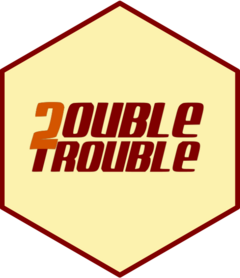

<!-- README.md is generated from README.Rmd. Please edit that file -->

# doubletrouble 

<!-- badges: start -->

[](https://github.com/almeidasilvaf/doubletrouble/issues)
[](https://lifecycle.r-lib.org/articles/stages.html#stable)
[](https://github.com/almeidasilvaf/doubletrouble/actions)
[](https://codecov.io/gh/almeidasilvaf/doubletrouble?branch=devel)
<!-- badges: end -->

The major goal of **doubletrouble** is to identify duplicated genes from
whole-genome protein sequences and classify them based on their modes of
duplication. Duplicates can be classified using four different
classification schemes, which increase the complexity and level of
details in a stepwise manner. The classification schemes and the
duplication modes they can classify are:

| Scheme   | Duplication modes          |
|:---------|:---------------------------|
| binary   | SD, SSD                    |
| standard | SD, TD, PD, DD             |
| extended | SD, TD, PD, TRD, DD        |
| full     | SD, TD, PD, rTRD, dTRD, DD |

*Legend:* **SD**, segmental duplication. **SSD**, small-scale
duplication. **TD**, tandem duplication. **PD**, proximal duplication.
**TRD**, transposon-derived duplication. **rTRD**,
retrotransposon-derived duplication. **dTRD**, DNA transposon-derived
duplication. **DD**, dispersed duplication.

Besides classifying gene pairs, users can also classify genes, so that
each gene is assigned to a unique mode of duplication.

Users can also calculate substitution rates per substitution site (i.e.,
$K_a$, $K_s$ and their ratios $\frac{K_a}{K_s}$) from duplicate pairs,
find peaks in Ks distributions with Gaussian Mixture Models (GMMs), and
classify gene pairs into age groups based on Ks peaks.

## Installation instructions

Get the latest stable `R` release from
[CRAN](http://cran.r-project.org/). Then install **doubletrouble** from
[Bioconductor](http://bioconductor.org/) using the following code:

``` r
if (!requireNamespace("BiocManager", quietly = TRUE)) {
    install.packages("BiocManager")
}

BiocManager::install("doubletrouble")
```

And the development version from
[GitHub](https://github.com/almeidasilvaf/doubletrouble) with:

``` r
BiocManager::install("almeidasilvaf/doubletrouble")
```

## Citation

Below is the citation output from using `citation('doubletrouble')` in
R. Please run this yourself to check for any updates on how to cite
**doubletrouble**.

``` r
print(citation('doubletrouble'), bibtex = TRUE)
#> To cite doubletrouble in publications, use:
#> 
#>   Almeida-Silva F, Van de Peer Y doubletrouble: an R/Bioconductor
#>   package for the identification, classification, and analysis of gene
#>   and genome duplications. Bioinformatics, 41(2), btaf043. (2025).
#>   https://doi.org/10.1093/bioinformatics/btaf043
#> 
#> A BibTeX entry for LaTeX users is
#> 
#>   @Article{,
#>     title = {doubletrouble: an R/Bioconductor package for the identification, classification, and analysis of gene and genome duplications},
#>     author = {Fabricio Almeida-Silva and Yves {Van de Peer}},
#>     journal = {Bioinformatics},
#>     year = {2025},
#>     volume = {41},
#>     number = {2},
#>     pages = {btaf043},
#>     url = {https://academic.oup.com/bioinformatics/article/41/2/btaf043/7979242},
#>     doi = {10.1093/bioinformatics/btaf043},
#>   }
```

Please note that the **doubletrouble** was only made possible thanks to
many other R and bioinformatics software authors, which are cited either
in the vignettes and/or the paper(s) describing this package.

## Code of Conduct

Please note that the **doubletrouble** project is released with a
[Contributor Code of
Conduct](http://bioconductor.org/about/code-of-conduct/). By
contributing to this project, you agree to abide by its terms.

## Development tools

- Continuous code testing is possible thanks to [GitHub
  actions](https://www.tidyverse.org/blog/2020/04/usethis-1-6-0/)
  through *[usethis](https://CRAN.R-project.org/package=usethis)*,
  *[remotes](https://CRAN.R-project.org/package=remotes)*, and
  *[rcmdcheck](https://CRAN.R-project.org/package=rcmdcheck)* customized
  to use [Bioconductor’s docker
  containers](https://www.bioconductor.org/help/docker/) and
  *[BiocCheck](https://bioconductor.org/packages/3.19/BiocCheck)*.
- Code coverage assessment is possible thanks to
  [codecov](https://codecov.io/gh) and
  *[covr](https://CRAN.R-project.org/package=covr)*.
- The [documentation
  website](http://almeidasilvaf.github.io/doubletrouble) is
  automatically updated thanks to
  *[pkgdown](https://CRAN.R-project.org/package=pkgdown)*.
- The code is styled automatically thanks to
  *[styler](https://CRAN.R-project.org/package=styler)*.
- The documentation is formatted thanks to
  *[devtools](https://CRAN.R-project.org/package=devtools)* and
  *[roxygen2](https://CRAN.R-project.org/package=roxygen2)*.

For more details, check the `dev` directory.

This package was developed using
*[biocthis](https://bioconductor.org/packages/3.19/biocthis)*.
